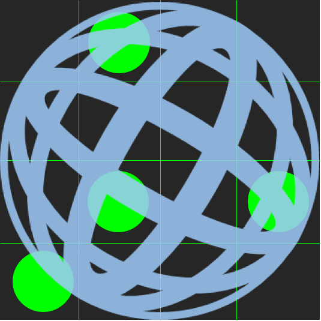

<div align="center">
  

  <h2>Gogo-js</h2>
</div>

<div align="center">
  <b><a href="#quickstart">QuickStart</a></b>
  |
  <b><a href="#requirements">Requirements</a></b>
  |
  <b><a href="#license">LICENSE</a></b>
</div>

QuickStart
---

```
$ npm i -g yarn # if you dont installed `yarn`.
$ yarn
$ yarn start
```


Requirements
---

- node >= *8.0.0*
- yarn >= *1.0.0*

LICENSE
---

WIP
